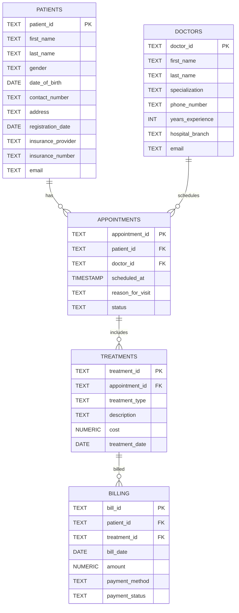

Hospital SQL Analytics 🏥

End-to-end SQL analytics project for hospital operations — schema design, ETL, data quality, indexes, KPIs, and visualization-ready outputs.

📌 Project Overview

This project simulates a hospital database and applies SQL analytics to answer key business questions.
It demonstrates data engineering (ETL), modeling, analytics, and documentation.

Designed a relational schema (patients, doctors, appointments, treatments, billing).

Built staging → transform → final tables pipeline.

Implemented data quality checks.

Added indexes for query performance.

Developed analytics queries (appointments, revenue, no-shows, patient LTV).

Created views & materialized views for reuse.

Exported sample outputs for reproducibility.

🗂 Repository Structure
hospital-sql-analytics/
├── sql/                  # All SQL scripts
│   ├── 01_schema.sql
│   ├── 02_staging.sql
│   ├── 03_transform.sql
│   ├── 04_quality.sql
│   ├── 05_indexes.sql
│   ├── 06_analytics.sql
│   └── 07_views_mat.sql
├── sample_outputs/        # CSV snapshots of queries
│   ├── daily_appointments.csv
│   ├── lead_time_summary.csv
│   ├── no_show_heatmap.csv
│   ├── daily_collections.csv
│   ├── monthly_revenue_by_specialty.csv
│   └── patient_ltv.csv
├── docs/
│   ├── ERD.png            # Entity-Relationship Diagram
│   └── SETUP_pgadmin.md   # Setup & troubleshooting guide
├── img/                   # Optional charts for README
└── README.md              # You are here

🏗 Entity Relationship Diagram (ERD)

📊 Key Analytics Queries

Daily Appointments → hospital load tracking

Lead Time Analysis → avg hours between booking & appointment

No-show Heatmap → missed appointments by weekday/hour

Daily Collections → cash inflow trend

Monthly Revenue by Specialty → service line performance

Patient Lifetime Value (LTV) → revenue per patient

Sample outputs are saved in /sample_outputs.

🚀 Setup & Reproduce

Follow docs/SETUP_pgadmin.md
 for step-by-step instructions.

🔎 Example Results

📈 Daily Appointments (Query A)
(from sample_outputs/daily_appointments.csv)

appointment_date	total_appointments
2023-01-01	14
2023-01-02	11
2023-01-03	18

💰 Monthly Revenue by Specialty (Query E)

month	specialty	revenue
2023-01	Cardiology	12500.00
2023-01	Pediatrics	8450.00
✅ Skills Demonstrated

SQL Engineering: schema, staging, transforms

Data Quality: referential integrity, null checks

Performance: indexing, EXPLAIN plans

Analytics: KPIs, trends, LTV

Documentation: ERD, setup guide, outputs, README

📌 Next Steps (Optional Enhancements)

Automate ETL with Airflow or dbt

Dashboarding in Power BI / Tableau

Add synthetic patient demographics for richer analysis

👤 Author

Varun Singh
Master’s in Engineering Management, Purdue University
📧 [varun.purdue24@gmail.com
] | 🌐 [https://www.linkedin.com/in/varun-singh-vss/]