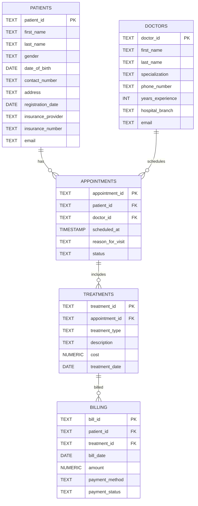

```mermaid
erDiagram
  PATIENTS ||--o{ APPOINTMENTS : has
  DOCTORS  ||--o{ APPOINTMENTS : schedules
  APPOINTMENTS ||--o{ TREATMENTS : includes
  TREATMENTS ||--o{ BILLING : billed

  PATIENTS {
    TEXT patient_id PK
    TEXT first_name
    TEXT last_name
    TEXT gender
    DATE date_of_birth
    TEXT contact_number
    TEXT address
    DATE registration_date
    TEXT insurance_provider
    TEXT insurance_number
    TEXT email
  }

  DOCTORS {
    TEXT doctor_id PK
    TEXT first_name
    TEXT last_name
    TEXT specialization
    TEXT phone_number
    INT  years_experience
    TEXT hospital_branch
    TEXT email
  }

  APPOINTMENTS {
    TEXT appointment_id PK
    TEXT patient_id FK
    TEXT doctor_id FK
    TIMESTAMP scheduled_at
    TEXT reason_for_visit
    TEXT status
  }

  TREATMENTS {
    TEXT treatment_id PK
    TEXT appointment_id FK
    TEXT treatment_type
    TEXT description
    NUMERIC cost
    DATE treatment_date
  }

  BILLING {
    TEXT bill_id PK
    TEXT patient_id FK
    TEXT treatment_id FK
    DATE bill_date
    NUMERIC amount
    TEXT payment_method
    TEXT payment_status
  }
```
